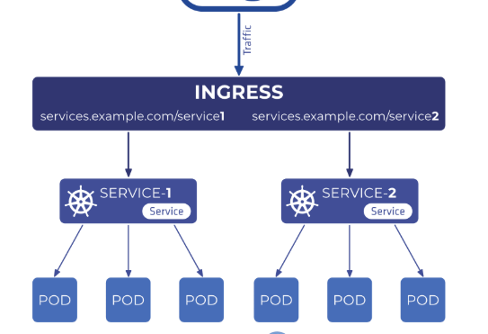
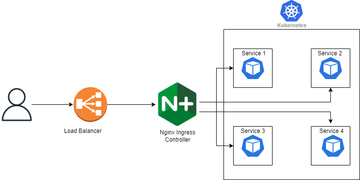
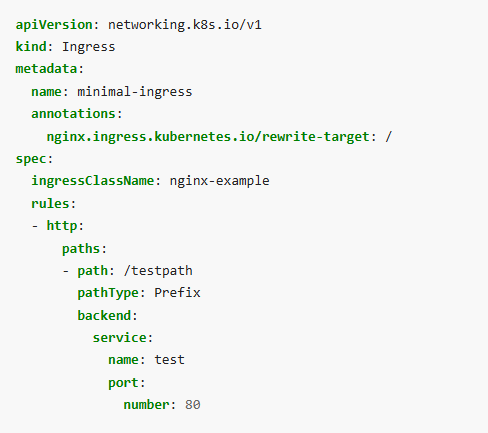

# Ingress
## Ingress là gì?
Ingress là một tài nguyên trong Kubernetes, được sử dụng để quản lý và định tuyến lưu lượng từ bên ngoài vào các dịch vụ (Service) bên trong cluster. Nó cung cấp các quy tắc định tuyến dựa trên:
- Hostname (ví dụ: example.com, api.example.com)
- Path (ví dụ: /api, /web)

Ingress hoạt động như một "cửa ngõ" tập trung, giúp tối ưu hóa việc quản lý luồng truy cập, giảm chi phí và tăng tính bảo mật.

Như hình bên cạnh đây, khi traffic từ bên ngoài đi đến ingress thì nó sẽ được định tuyến đến service phù hợp. Ví dụ khi có /service1 thì sẽ đến service1, còn /service2 thì sẽ đến service2. Nhưng mà để có thể làm được điều đó thì cần thêm một ingress controller. Chứ thật ra ingress nó giống như rule thôi. Còn ingress controller mới thật sự là thứ quyết định việc định tuyến.
## Tại sao cần ingress?

Khi bạn chỉ sử dụng Service, mỗi service sẽ cần một LoadBalancer hoặc một địa chỉ IP công cộng riêng để truy cập từ ngoài. Điều này sẽ rất tốn kém và phức tạp, đặc biệt khi có nhiều dịch vụ cần tiếp xúc với bên ngoài.

Tuy nhiên, khi sử dụng Ingress, bạn chỉ cần một LoadBalancer cho Ingress Controller và từ đó Ingress sẽ định tuyến các yêu cầu đến các dịch vụ cụ thể dựa trên các quy tắc (như là host hoặc path) mà bạn cấu hình. Điều này giúp giảm số lượng Load Balancer cần thiết, đồng thời quản lý và mở rộng dễ dàng hơn.

Còn khi sử dụng nodeport thì sao? Nó sẽ gặp vấn đề là mình đang mở một port trên tất cả các node và chuyển tiếp lưu lượng đến dịch vụ tương ứng. Bạn không thể dễ dàng định tuyến lưu lượng dựa trên host hoặc path như trong Ingress. Và khi có qua nhiều dịch vụ thì mình sẽ cần mở rất nhiều port.

Ngoài ra thì ingress cũng hỗ trợ cấu hình để sử dụng HTTPS (TLS) với chứng chỉ SSL. Bạn cần tạo một secret chứa chứng chỉ và khóa riêng tư, sau đó tham chiếu đến secret đó trong Ingress.

Nhưng phải nhớ rằng là mình vẫn phải expose ingress ra ngoài. Có thể là dùng load balancer hoặc nodeport.

## Ingress resources

Hình này thể hiện một ingress resources gồm 4 phần chính
- apiVersion:
- kind:
- metadata: Phần rewrite-taget thể hiện rằng path sẽ được viết lại. Ví dụ ở dưới khi mình vào một địa chỉ là: tuananh.com/testpath thì khi qua ingress sẽ thành tuananh.com/ thôi. Hoặc mình để là cái khác ví dụ là /xxx thì khi qua ingress nó sẽ được viết lại là tuananh.com/xxx hoặc nếu tuananh.com/testpath/deptrai sẽ thành tuananh.com/xxx/deptrai
- spec:
    - ingressClassName: chỉ định ingress controller nào sẽ xử lý
    - rules: 
        - Danh sách các đường dẫn (ví dụ: /testpath), mỗi đường dẫn có một backend liên kết được xác định. Ngoài ra cũng cần một default backend để nếu không khớp với path nào thì sẽ được điều hướng đến đấy
        - Ngoài ra còn có thể có thêm host phía trước (nếu không có host thì nó sẽ xử lý tất cả các yêu cầu đến nó, có nghĩa là áp dụng cho mọi host). 
        - Tiếp theo là pathType: 
            - Exact: Đúng như vậy, phải khớp chính xác. 
            - Prefix: Khớp với bất kỳ đường dẫn nào bắt đầu với prefix đó (ví dụ: /api sẽ khớp với /api/xyz). 
            - ImplementationSpecific: Loại này phụ thuộc vào Ingress controller (thường không khuyến nghị).
## Ingress with TLS

