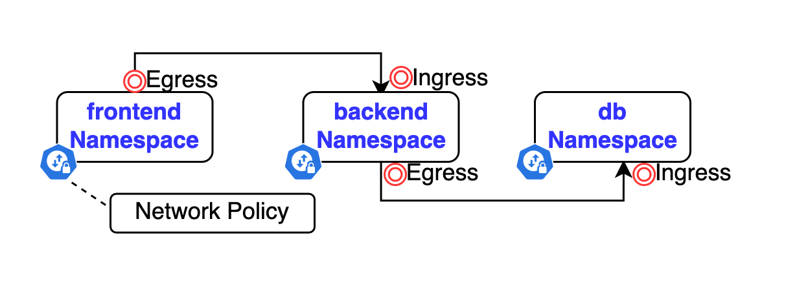

# Network Policies
## Định nghĩa

- Network Policies là một loại resource trong Kubernetes cho phép bạn định nghĩa các quy tắc kiểm soát lưu lượng mạng (ingress và egress) cho các Pod, giúp bảo vệ và quản lý mạng trong cluster. Mục đích chính của Network Policies là kiểm soát lưu lượng mạng giữa các Pod hoặc giữa các Pod và các dịch vụ bên ngoài.

- Hiểu đơn giản nhất là nó giống security group trong aws.

- Để có thể sử dụng network policies thì cần phải có plugin mạng hỗ trợ network policies. Ví dụ calico, ... Flannel không hỗ trợ network policies

- 